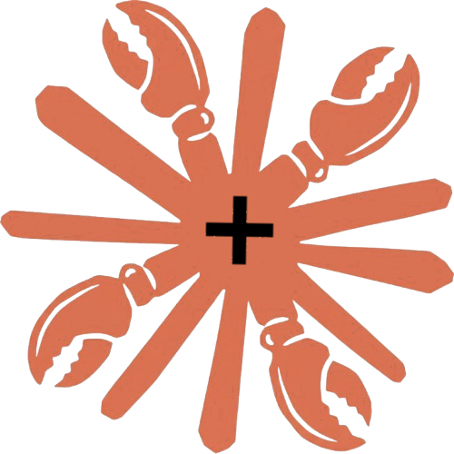

<p align="center">
  
</p>

# claudeclaw-plus-container

[](https://github.com/paulmeier/claudeclaw-plus-container/releases)
[](https://github.com/paulmeier/claudeclaw-plus-container/releases)
[](https://github.com/paulmeier/claudeclaw-plus-container/commits/main)
[](https://github.com/paulmeier/claudeclaw-plus-container/actions/workflows/release-please.yml)
[](https://github.com/paulmeier/claudeclaw-plus-container/actions/workflows/lint.yml)
[](https://github.com/paulmeier/claudeclaw-plus-container/actions/workflows/security.yml)
[](https://github.com/paulmeier/claudeclaw-plus-container/pkgs/container/claudeclaw-plus-container)
[](LICENSE)

Docker container for [ClaudeClaw+](https://github.com/TerrysPOV/ClaudeClaw-Plus) — a superset of [claudeclaw](https://github.com/moazbuilds/claudeclaw) that adds a governance and policy layer, durable multi-step orchestration, persistent cross-session memory, and a hardened web UI on top of the upstream daemon. ClaudeClaw+ syncs from upstream daily, so everything in vanilla claudeclaw is here too — Telegram, Discord, and Slack bridges, scheduled jobs, voice transcription, and the web dashboard.

> Looking for the vanilla container? See [paulmeier/claudeclaw-container](https://github.com/paulmeier/claudeclaw-container).

---

## Why run ClaudeClaw+ in a container?

**Zero host pollution.** ClaudeClaw+ depends on Bun, Node.js, and the Claude Code CLI. Running it natively means installing and maintaining all of that on your machine. The container bundles everything — your host stays clean.

**Controlled access.** By default the daemon can only see what you explicitly give it. Want it to access your notes? Mount that folder. Everything else on your machine is invisible to it. Running natively, ClaudeClaw+ inherits access to your entire filesystem.

**Easy to run on a server.** The same image runs on a VPS, home server, or cloud instance without any changes. Your personal assistant stays online even when your laptop is closed.

**Instant reset.** Something went wrong or you want a clean slate? `docker compose down -v` removes everything. No leftover config files scattered across your home directory.

**Reproducible.** The container always starts from a known state. No "works on my machine" issues caused by a different Bun version, a conflicting global npm package, or a PATH quirk.

---

## Prerequisites

- [Docker](https://docs.docker.com/get-docker/) with Compose
- A Claude Code subscription (claude.ai/code) — no API key required
- Optional: a Telegram bot token, Discord bot token, or Slack app token for messaging

---

## Authentication

ClaudeClaw+ wraps the `claude` CLI directly and uses your existing Claude Code credentials — it does **not** require an `ANTHROPIC_API_KEY`. Before starting the container you need to authenticate Claude Code into the persistent volume once.

**Step 1 — create the volume and log in:**

```bash
docker compose run --rm claudeclaw-plus claude login
```

This opens an OAuth browser flow. Complete it and your credentials are saved to the volume at `/root/.claude/.credentials.json`. You only need to do this once — credentials persist across container restarts.

**Step 2 — start the daemon:**

```bash
docker compose up -d
```

**Alternatively**, if you already have Claude Code authenticated on your host machine, you can copy your credentials directly into the volume:

```bash
docker run --rm \
  -v claudeclaw-plus-data:/root/.claude \
  -v ~/.claude:/host-claude:ro \
  alpine cp /host-claude/.credentials.json /root/.claude/.credentials.json
```

---

## Quick start

```bash
git clone https://github.com/paulmeier/claudeclaw-plus-container
cd claudeclaw-plus-container
docker compose run --rm claudeclaw-plus claude login   # authenticate once
docker compose up -d
```

The web dashboard will be available at `http://localhost:4632`.

On first run the container will:

1. Create a default `settings.json` on the volume
2. Download the whisper.cpp binary and `base.en` model (~140 MB) for voice transcription
3. Install the `dev-browser` Claude Code plugin

These are all cached in the volume and skipped on subsequent starts.

The image ships Chromium runtime libraries pre-installed (Playwright's canonical Debian 13 dependency set), so the `dev-browser` plugin launches Chromium without needing `apt-get` inside the container — which is blocked anyway in hardened deployments that drop `CAP_SETGID`. The previous bookworm-slim base required consumers to swap the `dev-browser` binary for its musl variant to work around an out-of-date glibc; that workaround is **no longer needed** — trixie-slim ships glibc 2.41, satisfying the upstream `dev-browser-linux-{x64,arm64}` binaries directly on both `linux/amd64` and `linux/arm64`.

---

## Configuration

ClaudeClaw+ inherits the upstream `claudeclaw` configuration model, plus its own additions for governance, orchestration, and memory. All configuration lives in `settings.json` inside the named volume at `/root/.claude/claudeclaw/settings.json`.

For the full set of Plus-specific options (policy engine, audit log, model routing, persistent memory), see [the ClaudeClaw+ docs](https://github.com/TerrysPOV/ClaudeClaw-Plus).

The easiest ways to edit the file:

**Option A — edit in place after first run:**

```bash
docker compose up -d
docker compose exec claudeclaw-plus cat /root/.claude/claudeclaw/settings.json
# copy, edit locally, then:
docker compose cp settings.json claudeclaw-plus:/root/.claude/claudeclaw/settings.json
docker compose restart
```

**Option B — bind-mount your own:**

Place a `settings.json` next to `docker-compose.yml`, then uncomment the bind-mount line in `docker-compose.yml`:

```yaml
volumes:
  - ./settings.json:/root/.claude/claudeclaw/settings.json:ro
```

> **Do not commit `settings.json`** — it contains your API tokens. It is already in `.gitignore`.

### Settings reference (upstream-compatible subset)

```jsonc
{
  "model": "sonnet", // "opus", "sonnet", or "haiku"

  "web": {
    "enabled": true,
    "host": "0.0.0.0", // do not change — required for container networking
    "port": 4632,
  },

  "telegram": {
    "token": "", // BotFather token
    "allowedUserIds": [], // numeric Telegram user IDs who can interact
    "receiveEnabled": true, // set true to listen for incoming messages
  },

  "discord": {
    "token": "", // Discord bot token
    "allowedUserIds": [], // Discord snowflake user IDs (as strings)
    "listenChannels": [], // channel IDs to listen in
    "listenGuilds": [], // guild IDs (leave empty to listen in all guilds)
  },

  "slack": {
    "botToken": "", // xoxb-... bot token
    "appToken": "", // xapp-... app-level token (Socket Mode)
    "allowedUserIds": [], // Slack member IDs
    "listenChannels": [], // channel IDs to listen in
  },

  "heartbeat": {
    "enabled": false, // periodic check-ins from the daemon
    "interval": 60, // minutes between heartbeats
    "prompt": "...", // prompt sent each heartbeat
    "forwardToTelegram": false,
  },

  "security": {
    "level": "moderate", // "locked", "strict", "moderate", or "unrestricted"
  },
}
```

---

## Messaging setup

### Telegram

1. Create a bot via [@BotFather](https://t.me/BotFather) and copy the token
2. Get your numeric user ID from [@userinfobot](https://t.me/userinfobot)
3. Set in `settings.json`:
   ```json
   "telegram": {
     "token": "123456:ABC-...",
     "allowedUserIds": [987654321],
     "receiveEnabled": true
   }
   ```
4. Restart the container — no extra ports needed, Telegram uses outbound polling

### Discord

1. Create a bot at [discord.com/developers](https://discord.com/developers/applications)
2. Under **Bot**, enable **Message Content Intent**
3. Copy the bot token
4. Invite the bot to your server with the `bot` scope and `Send Messages` + `Read Message History` permissions
5. Get channel/guild IDs by enabling Developer Mode in Discord (Settings → Advanced), then right-clicking a channel or server
6. Set in `settings.json`:
   ```json
   "discord": {
     "token": "your-bot-token",
     "allowedUserIds": ["your-snowflake-id"],
     "listenChannels": ["channel-id"],
     "listenGuilds": ["guild-id"]
   }
   ```
7. Restart the container — Discord uses outbound WebSockets, no extra ports needed

### Slack

1. Create a Slack app at [api.slack.com/apps](https://api.slack.com/apps) with **Socket Mode** enabled
2. Under **OAuth & Permissions**, add `chat:write`, `channels:history`, `im:history` scopes and install to workspace
3. Copy the **Bot User OAuth Token** (`xoxb-...`)
4. Under **Basic Information → App-Level Tokens**, create a token with `connections:write` scope
5. Copy the **App-Level Token** (`xapp-...`)
6. Set in `settings.json`:
   ```json
   "slack": {
     "botToken": "xoxb-...",
     "appToken": "xapp-...",
     "allowedUserIds": ["U012AB3CD"],
     "listenChannels": ["C012AB3CD"]
   }
   ```
7. Restart the container

---

## Mounting additional directories

You can give ClaudeClaw+ access to any directory on your host — notes, documents, code, media — by adding bind mounts to `docker-compose.yml`.

### Read-only access

Use `:ro` when you want the daemon to read files but never modify them:

```yaml
services:
  claudeclaw-plus:
    volumes:
      - claudeclaw-plus-data:/root/.claude # always keep this one
      - /Users/you/Notes:/mnt/notes:ro
      - /Users/you/Documents:/mnt/documents:ro
```

Inside the container those directories appear at `/mnt/notes` and `/mnt/documents`. ClaudeClaw+ can read, search, and reference them but cannot write back to your host.

### Read-write access

Omit `:ro` to allow the daemon to create, edit, and delete files:

```yaml
volumes:
  - claudeclaw-plus-data:/root/.claude
  - /Users/you/Notes:/mnt/notes # full read-write
```

Use this when you want ClaudeClaw+ to save notes, update files, or write output back to your machine.

### Tips

**Use absolute paths.** Relative paths and `~` don't expand in `docker-compose.yml`. Use the full path or an environment variable:

```yaml
- ${HOME}/Notes:/mnt/notes
```

**Choose mount paths that are easy to reference.** ClaudeClaw+ will see whatever path you pick on the right side of the `:`. Keeping them short and under `/mnt/` makes it easy to refer to them in prompts and job definitions — for example: _"summarise everything in /mnt/notes from this week"_.

**Apply least privilege.** Mount read-write only for directories the daemon actually needs to write to. Everything else should be `:ro`.

**Changes take effect after a restart:**

```bash
docker compose down && docker compose up -d
```

---

## Web dashboard

Available at `http://localhost:4632` when `web.enabled` is `true`. Shows active jobs, logs, and session status. To access it from a remote host, either expose the port via a reverse proxy or change the port mapping in `docker-compose.yml`.

---

## Building a specific ClaudeClaw+ version

By default the image clones the `main` branch. To pin to a tag or commit:

```bash
docker build --build-arg CLAUDECLAW_PLUS_REF=<branch|tag|sha> -t claudeclaw-plus .
```

---

## Persistent data

Everything is stored in the `claudeclaw-plus-data` named volume at `/root/.claude/`:

| Path                       | Contents                                |
| -------------------------- | --------------------------------------- |
| `claudeclaw/settings.json` | Your configuration                      |
| `claudeclaw/logs/`         | Job and session logs                    |
| `claudeclaw/jobs/`         | Scheduled job definitions               |
| `claudeclaw/whisper/`      | whisper.cpp binary + model files        |
| `plugins/`                 | Installed Claude Code plugins           |
| `npm-global/`              | Globally installed npm packages + bins  |
| `npm-cache/`               | npm download cache; `_npx/` subdir holds the npx tarball cache |
| `python-user/`             | `pip install` site-packages + bins      |
| `pip-cache/`               | pip download cache                      |
| `pnpm-global/`             | pnpm content-addressable store, manifest, and `bin/` shims |
| `uv-tools/`                | `uv tool install` isolated venvs        |
| `uv-tool-bin/`             | UV tool shims + bins                    |
| `uv-cache/`                | UV download cache; `uvx` environments   |
| `uv-python/`               | UV-managed Python installations         |

To back up or inspect the volume:

```bash
# Dump to a tar archive
docker run --rm -v claudeclaw-plus-data:/data -v $(pwd):/backup alpine \
  tar czf /backup/claudeclaw-plus-backup.tar.gz -C /data .

# Restore
docker run --rm -v claudeclaw-plus-data:/data -v $(pwd):/backup alpine \
  tar xzf /backup/claudeclaw-plus-backup.tar.gz -C /data
```

---

## Adding npm packages

Some Claude Code skills (and your own prompts) call out to CLI tools via `npm install -g` or `npx`. By default those land in `/usr/lib/node_modules` and `/root/.npm` — both inside the container's writable layer and **wiped on every image pull**. To avoid re-installing on every update, the container redirects npm into the persistent volume so packages and the npx cache survive container recreation and image rebuilds.

### How it works

On every start, `entrypoint.sh` exports:

| Variable                                       | Effect                                                  |
| ---------------------------------------------- | ------------------------------------------------------- |
| `NPM_CONFIG_PREFIX=/root/.claude/npm-global`   | Global installs go to `npm-global/lib/node_modules/`, executables to `npm-global/bin/` |
| `NPM_CONFIG_CACHE=/root/.claude/npm-cache`     | npm and npx tarball cache                               |
| `PATH=/root/.claude/npm-global/bin:$PATH`      | Global binaries are on `PATH` for the daemon and every process it spawns (skills, jobs, `docker exec`) |

Because `/root/.claude` is the named volume, anything written under these paths sticks around across `docker compose down && up`, `docker compose pull`, and image rebuilds. The persistent layout adds these to the volume:

```
/root/.claude/
├── npm-global/
│   ├── bin/        # binaries on PATH
│   └── lib/node_modules/
└── npm-cache/      # npm + npx tarball cache
```

`NPM_CONFIG_*` env vars take precedence over `.npmrc`, so this also works if you bind-mount your own `.npmrc`.

### Installing a package

From a running container, or from a Claude Code skill:

```bash
docker compose exec claudeclaw-plus npm install -g cowsay
docker compose exec claudeclaw-plus cowsay hello   # binary persists across restarts
```

### npx

`npx` requires no separate setup. Because `NPM_CONFIG_CACHE` already points into the volume, npx's download cache (`npm-cache/_npx/`) is persisted automatically — the tarball is fetched once and reused across container recreations:

```bash
docker compose exec claudeclaw-plus npx cowsay hello   # downloads on first call
docker compose exec claudeclaw-plus npx cowsay hello   # reads from volume cache
```

Note that npx does not maintain a persistent global install — it downloads, runs, and exits. The volume caches the tarball so subsequent calls are fast, but there is no equivalent of `npm install -g` to migrate. If a Node major version bump breaks a cached npx package with native addons, clear the cache and npx will redownload a fresh copy on the next call:

```bash
docker compose exec claudeclaw-plus rm -rf /root/.claude/npm-cache/_npx
```

### Bake packages into a custom image

If you'd rather not depend on the entrypoint running before a package is available (for example, packages needed at image-build time or referenced by other tooling), extend the base image:

```Dockerfile
FROM ghcr.io/paulmeier/claudeclaw-plus-container:latest
RUN npm install -g cowsay some-other-pkg
```

Then point `docker-compose.yml` at the new image:

```yaml
services:
  claudeclaw-plus:
    image: my/claudeclaw-plus:latest
```

### Node version migration

npm global packages all live in a single `npm-global/lib/node_modules/` directory — there is no version-keyed subdirectory like Python's `lib/pythonX.Y/`. Pure JavaScript packages keep working across Node major versions without any action. The problem is **native addons** (packages that compile `.node` binaries via `node-gyp`): those are built against a specific Node ABI and will fail to load under a different major version. Reinstalling forces npm to recompile them for the current runtime.

Run `migrate-npm.sh` inside the container after a base image update that bumps the Node major version:

```bash
docker compose exec claudeclaw-plus /migrate-npm.sh
```

The script reads `name` and `version` from each top-level `package.json` in `npm-global/lib/node_modules/` (including scoped packages), then calls `npm install -g name@version` for all of them, recompiling any native addons for the current Node ABI.

For **npx**, there is nothing to reinstall — npx redownloads on demand. If a cached npx package fails due to a stale native addon, clear the npx cache:

```bash
docker compose exec claudeclaw-plus rm -rf /root/.claude/npm-cache/_npx
```

### Caveats

- Wiping the volume (`docker compose down -v`) removes installed packages along with everything else. Use [`backup.sh`](#backups) if you want them preserved.
- If the base image's Node major version bumps, native addons will break. Run [`/migrate-npm.sh`](#node-version-migration) to reinstall and recompile them.
- The volume is shared across all ClaudeClaw+ state, so a runaway `npm install` can consume significant space. `du -sh /root/.claude/npm-*` to audit.

---

## Adding Python packages

Same story as npm. Some Claude Code skills shell out to `pip install` for Python tooling, and the default install location (`/root/.local/` or system `site-packages`) sits inside the writable image layer — wiped on every image pull. The container redirects `pip` into the persistent volume so installed packages and the pip cache survive container recreation and image rebuilds.

### How it works

On every start, `entrypoint.sh` exports:

| Variable                                       | Effect                                                  |
| ---------------------------------------------- | ------------------------------------------------------- |
| `PYTHONUSERBASE=/root/.claude/python-user`     | `pip install --user` site-packages and scripts go to `python-user/lib/pythonX.Y/site-packages/` and `python-user/bin/` |
| `PIP_USER=1`                                   | `pip install` defaults to `--user` mode (no need to pass it every time) |
| `PIP_BREAK_SYSTEM_PACKAGES=1`                  | Bypasses Debian's PEP 668 "externally managed" warning. Safe here because we're never touching system `site-packages` — only the relocated user-base |
| `PIP_CACHE_DIR=/root/.claude/pip-cache`        | pip download cache                                      |
| `PATH=/root/.claude/python-user/bin:$PATH`     | Installed Python scripts are on `PATH` for the daemon and every process it spawns |

Layout added to the volume:

```
/root/.claude/
├── python-user/
│   ├── bin/        # scripts on PATH
│   └── lib/pythonX.Y/site-packages/
└── pip-cache/      # pip download cache
```

### Installing a package

From a running container, or from a Claude Code skill:

```bash
docker compose exec claudeclaw-plus pip install httpie
docker compose exec claudeclaw-plus http --version   # binary persists across restarts
```

### Bake packages into a custom image

Same pattern as npm — extend the base image:

```Dockerfile
FROM ghcr.io/paulmeier/claudeclaw-plus-container:latest
RUN pip install httpie ruff
```

### Python version migration

**If you are upgrading from a pre-trixie image** (anything built on the old `node:24-slim` / bookworm-slim base), the first start on a trixie-based image triggers exactly this case: bookworm-slim shipped python3.11; trixie-slim ships python3.13. Existing pip-installed packages under `python-user/lib/python3.11/` become invisible to python3.13. The healthcheck on startup prints a warning pointing here; run `docker compose exec claudeclaw-plus /migrate-python.sh` to restore them.

Python user-base directories are keyed by minor version (`lib/python3.11/`, `lib/python3.12/`, …). When the base image's Python minor version bumps, packages installed under the old version become **invisible** to the new interpreter — the old `site-packages/` directory still exists on disk but is simply not on the new Python's search path. Run `migrate-python.sh` inside the container to reinstall them:

```bash
docker compose exec claudeclaw-plus /migrate-python.sh
```

The script scans every old `pythonX.Y` directory under `python-user/lib/`, reads each package's name and version from `.dist-info/METADATA`, and calls `pip install` to reinstall them under the current version. The old directories are left in place so you can verify nothing is missing before removing them:

```bash
# Confirm your packages work, then clean up the old directory
docker compose exec claudeclaw-plus rm -rf /root/.claude/python-user/lib/python3.11
```

### Caveats

- Python user-base is keyed by Python minor version (`python3.11/site-packages` etc.). If the base image's Python minor version ever bumps, previously installed packages become invisible — run [`/migrate-python.sh`](#python-version-migration) to recover them.
- For Python CLI tools specifically, [`uv tool install`](#adding-uv-packages) avoids this problem: UV tools live in named venvs, not version-keyed directories, so they survive Python minor version changes more gracefully.
- `du -sh /root/.claude/python-*` to audit space usage.

---

## Adding pnpm packages

pnpm is pre-installed in the image. Its global package shims and content-addressable store are both redirected into the persistent volume so packages added with `pnpm add -g` survive container recreation and image rebuilds.

### How it works

On every start, `entrypoint.sh` exports:

| Variable                                       | Effect                                                  |
| ---------------------------------------------- | ------------------------------------------------------- |
| `PNPM_HOME=/root/.claude/pnpm-global`          | pnpm's content-addressable store, global manifest, and `bin/` shims all land under here |
| `PATH=/root/.claude/pnpm-global/bin:$PATH`     | Shims are on `PATH` for the daemon and every process it spawns |

Layout added to the volume:

```
/root/.claude/pnpm-global/
├── bin/        # shim scripts on PATH (one per globally installed package)
├── global/     # pnpm global manifest
└── store/      # content-addressable package store
```

### Installing a package

From a running container, or from a Claude Code skill:

```bash
docker compose exec claudeclaw-plus pnpm add -g cowsay
docker compose exec claudeclaw-plus cowsay hello   # shim persists across restarts
```

### Bake packages into a custom image

```Dockerfile
FROM ghcr.io/paulmeier/claudeclaw-plus-container:latest
RUN pnpm add -g cowsay some-other-pkg
```

Then point `docker-compose.yml` at the new image:

```yaml
services:
  claudeclaw-plus:
    image: my/claudeclaw-plus:latest
```

### Node version migration

pnpm global packages face the same native addon problem as npm globals — `.node` binaries compiled against the old ABI fail silently under a new Node major version. Run `migrate-pnpm.sh` to reinstall:

```bash
docker compose exec claudeclaw-plus /migrate-pnpm.sh
```

The script calls `pnpm ls --global --json --depth=0` to enumerate installed packages, then reinstalls each pinned `name@version` with `pnpm add -g`, forcing recompilation of any native addons.

### Caveats

- Wiping the volume (`docker compose down -v`) removes all pnpm global packages and the store along with everything else. Use [`backup.sh`](#backups) to preserve them.
- If the base image's Node major version bumps, native addons will break. Run [`/migrate-pnpm.sh`](#node-version-migration-1) to reinstall and recompile them.
- `du -sh /root/.claude/pnpm-*` to audit space usage. The content-addressable store deduplicates package content but can still grow large if many different versions are installed over time.

---

## Adding UV packages

[uv](https://docs.astral.sh/uv/) is a fast Python package and project manager from Astral. It is pre-installed in the image. Unlike `pip install --user`, UV installs tools into **isolated virtual environments** so each tool has its own dependency tree with no conflicts.

### How it works

On every start, `entrypoint.sh` exports:

| Variable                                           | Effect                                                  |
| -------------------------------------------------- | ------------------------------------------------------- |
| `UV_TOOL_DIR=/root/.claude/uv-tools`               | Isolated venvs for each `uv tool install`-ed package    |
| `UV_TOOL_BIN_DIR=/root/.claude/uv-tool-bin`        | Shim scripts for tool executables; added to `PATH`      |
| `UV_CACHE_DIR=/root/.claude/uv-cache`              | Download cache; also holds `uvx` ephemeral environments |
| `UV_PYTHON_INSTALL_DIR=/root/.claude/uv-python`    | Python versions downloaded via `uv python install`      |

Layout added to the volume:

```
/root/.claude/
├── uv-tools/       # one subdirectory per installed tool, each containing an isolated venv
├── uv-tool-bin/    # shim scripts on PATH
├── uv-cache/       # download cache; uvx/_/... for uvx ephemeral environments
└── uv-python/      # UV-managed Python installations
```

### Installing a tool

`uv tool install` installs a Python application into its own isolated venv and creates a shim in `uv-tool-bin/` so the executable is available on PATH:

```bash
docker compose exec claudeclaw-plus uv tool install ruff
docker compose exec claudeclaw-plus ruff --version   # shim persists across restarts
```

Upgrade a tool to a newer version:

```bash
docker compose exec claudeclaw-plus uv tool install --upgrade ruff
```

List installed tools:

```bash
docker compose exec claudeclaw-plus uv tool list
```

### uvx

`uvx` runs a Python tool without permanently installing it — equivalent to `npx` for Python. UV downloads the package into a temporary environment in `UV_CACHE_DIR` and runs it:

```bash
docker compose exec claudeclaw-plus uvx cowsay hello   # downloads on first call
docker compose exec claudeclaw-plus uvx cowsay hello   # reads from volume cache
```

No persistent entry is left behind. The volume cache means subsequent calls are fast, even after container recreation.

### Bake tools into a custom image

```Dockerfile
FROM ghcr.io/paulmeier/claudeclaw-plus-container:latest
RUN uv tool install ruff httpie
```

### Python version migration

UV tools run in isolated venvs that record the **absolute path** of the Python interpreter they were created with (e.g. `/usr/bin/python3.11`). This is different from the pip problem: pip packages become *invisible* because the version-keyed directory is no longer searched; UV tool venvs become *invalid* because the recorded interpreter path no longer exists. The symptom is also different — pip-installed scripts silently produce import errors, while UV tool shims fail immediately at exec time.

If the base image's system Python minor version changes (e.g. 3.11 → 3.12), run `migrate-uv.sh` to recreate each venv under the current Python:

```bash
docker compose exec claudeclaw-plus /migrate-uv.sh
```

The script reads the original package name and version specifier from each tool's `uv-receipt.json`, then calls `uv tool install --reinstall` to rebuild the venv.

`uvx` environments are simpler to recover — they are ephemeral by design. The cache just makes repeat calls fast; nothing needs to be reinstalled. If a `uvx` environment is broken, clear the cache and it will be rebuilt on the next call:

```bash
docker compose exec claudeclaw-plus uv cache clean
```

### Caveats

- Wiping the volume (`docker compose down -v`) removes all UV tool venvs and the cache. Use [`backup.sh`](#backups) to preserve them.
- If the base image's Python minor version bumps, tool venvs become stale. Run [`/migrate-uv.sh`](#python-version-migration-1) to recreate them.
- UV-managed Pythons (`uv python install`) are persisted under `uv-python/` in the volume. If you rely on a specific UV-managed Python for your tools, it will survive image rebuilds without being re-fetched.
- `du -sh /root/.claude/uv-*` to audit space usage.

---

## Backups

`backup.sh` snapshots the entire ClaudeClaw+ data — credentials, settings, logs, jobs, whisper models, plugins, and session history — into a timestamped archive. It can be run from the host or from inside the container.

### From the host

```bash
./backup.sh
# Saved: ./backups/claudeclaw-plus-2026-05-15-143022.tar.gz (187M)
```

Archives are written to `./backups/` by default. Override with `CLAUDECLAW_PLUS_BACKUP_DIR`:

```bash
CLAUDECLAW_PLUS_BACKUP_DIR=~/Backups/claudeclaw-plus ./backup.sh
```

The script accesses the volume via a temporary Docker container, so it is safe to run while the daemon is running.

### From inside the container

Mount a backup destination into the container, then run `/backup.sh`:

```bash
# One-off via docker compose run
docker compose run -v ~/Backups/claudeclaw-plus:/backup claudeclaw-plus /backup.sh

# Or exec into a running container
docker compose exec -e CLAUDECLAW_PLUS_BACKUP_DIR=/backup claudeclaw-plus /backup.sh
```

To make this permanent, uncomment the backup mount in `docker-compose.yml`:

```yaml
volumes:
  - claudeclaw-plus-data:/root/.claude
  - ${HOME}/Backups/claudeclaw-plus:/backup
```

Then from any shell inside the container:

```bash
/backup.sh
# or with a custom path:
CLAUDECLAW_PLUS_BACKUP_DIR=/backup /backup.sh
```

### Restore

```bash
docker compose down
docker volume rm claudeclaw-plus-data
docker run --rm \
  -v claudeclaw-plus-data:/data \
  -v /path/to/backups:/backup:ro \
  alpine tar xzf /backup/claudeclaw-plus-2026-05-15-143022.tar.gz -C /data
docker compose up -d
```

### zsh alias

Add to your `~/.zshrc` to run a host-side backup from anywhere:

```bash
alias claudeclaw-plus-backup='/bin/zsh -l /Users/you/Projects/claudeclaw-plus-container/backup.sh'
```

Then `source ~/.zshrc` and call `claudeclaw-plus-backup` whenever you want a snapshot.

---

## Desktop terminal access

`shell.sh` starts the container if it isn't running and drops you straight into the Claude CLI inside it:

```bash
./shell.sh
```

### iTerm2 profile

Create a dedicated iTerm2 profile so you can open a ClaudeClaw+ terminal from the menu or a hotkey:

1. iTerm2 → Settings → Profiles → `+`
2. Name it **claudeclaw-plus**
3. Under **Command**, select *Command* and enter:
   ```
   /bin/zsh -l /Users/you/Projects/claudeclaw-plus-container/shell.sh
   ```
4. Optionally assign a hotkey under **Keys → Hotkey Window** for instant access

The `-l` flag loads your login shell environment so `docker` is on the PATH.

### zsh alias

Add to your `~/.zshrc` for one-word access from any terminal:

```bash
alias claudeclaw-plus='/bin/zsh -l /Users/you/Projects/claudeclaw-plus-container/shell.sh'
```

Then run `source ~/.zshrc` and type `claudeclaw-plus` anywhere.

---

## Health check

`healthcheck.sh` runs automatically at every container start and is available as `/healthcheck` (no `.sh`) at any time:

```bash
docker compose exec claudeclaw-plus /healthcheck
```

It reports:

- **Runtimes** — Node version and ABI, npm, pnpm, Bun, Python, pip, and uv versions
- **npm globals** — installed packages with versions; warns if the Node ABI has changed since the last start (indicating native addons may be broken)
- **pnpm globals** — same ABI check for pnpm-managed globals
- **pip user packages** — lists installed packages; warns if stale `pythonX.Y/site-packages/` directories from an older Python minor version are found
- **uv tools** — lists installed tools; detects broken venvs by checking that the Python interpreter path recorded in each venv's `pyvenv.cfg` still exists on disk
- **Volume disk usage** — size of every package manager directory under `/root/.claude/`
- **Environment** — the active values of all package-manager env vars (`NPM_CONFIG_PREFIX`, `PYTHONUSERBASE`, `UV_TOOL_DIR`, etc.) so you can verify they point where expected

Warnings include the exact migration command to run. The script exits 0 regardless of warnings — they are advisory and do not block startup.

---

## Troubleshooting

**Container exits immediately**
Check logs: `docker compose logs`. Usually a missing or malformed `settings.json`.

**Web dashboard not loading**
Ensure `web.enabled` is `true` and `web.host` is `"0.0.0.0"` in settings. The entrypoint auto-corrects `127.0.0.1` → `0.0.0.0`, but other values are left as-is.

**Bot not responding to messages**

- Confirm the token is correct and the user ID is in `allowedUserIds`
- For Discord: verify Message Content Intent is enabled in the developer portal
- Check logs: `docker compose logs -f`

**Whisper download fails on first start**
The container needs outbound internet access. If behind a proxy, set `HTTP_PROXY` / `HTTPS_PROXY` environment variables in `docker-compose.yml`.
